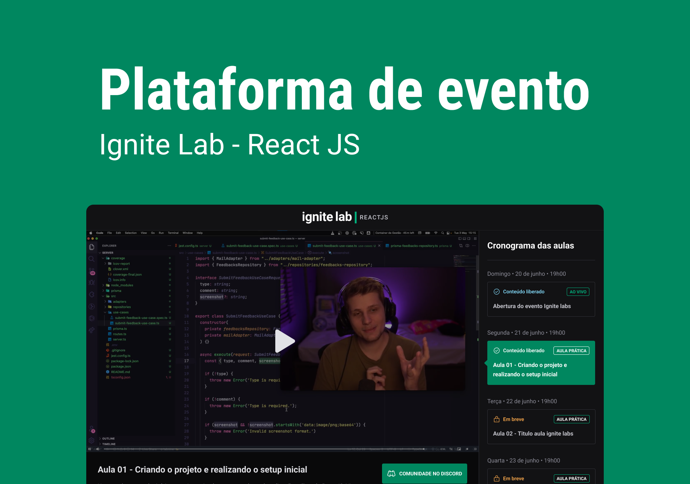

<p align="center">
  
</p>

<p align="center">
  
  
  

     
</p>

<h1 align="center">
  
</h1>

<br />

## 💻 Projeto

Projeto de uma plataforma de um evento de especialização em front-end usando React.

## 🧪 Tecnologias

Esse projeto foi desenvolvido com as seguintes tecnologias

- [ReactJS](https://reactjs.org)
- [Vite](https://vitejs.dev)
- [TailwindCSS](https://tailwindcss.com/)
- [GraphCMS](https://graphcms.com/)
- [GraphQL](https://graphql.org/)
- [TypeScript](https://www.typescriptlang.org/)

## 🚀 Como executar

Antes de começar a executar esse projeto é necessário ter o [Node.js](https://nodejs.org/) e o [Git](https://git-scm.com) instalado na sua máquina

Primeiro você deve clonar esse repositório e entre na pasta desse repositório que havia sido clonado, caso você não queira seguir esse passo você pode baixar esse repositório em arquivo .zip nesse link [download .zip](https://github.com/pduartesilva2005/ignite-lab/archive/refs/heads/main.zip)

```bash
$ git clone https://github.com/pduartesilva2005/ignite-lab
$ cd ignite-lab
```

A seguir, siga os passos abaixo:

```bash
# Instale as dependências rodando este comando:
$ yarn or npm install
# Inicie o projeto rodando este comando:
$ yarn dev or npm run dev
```

O app estará disponível no seu navegando acessando o endereço http://localhost:3000.

## 📝 License

Esse projeto está sob a licença MIT. Veja o arquivo [LICENSE](.github/LICENSE.md) para mais detalhes.

---

Feito com 💜 by Pedro Duarte 👋🏻
